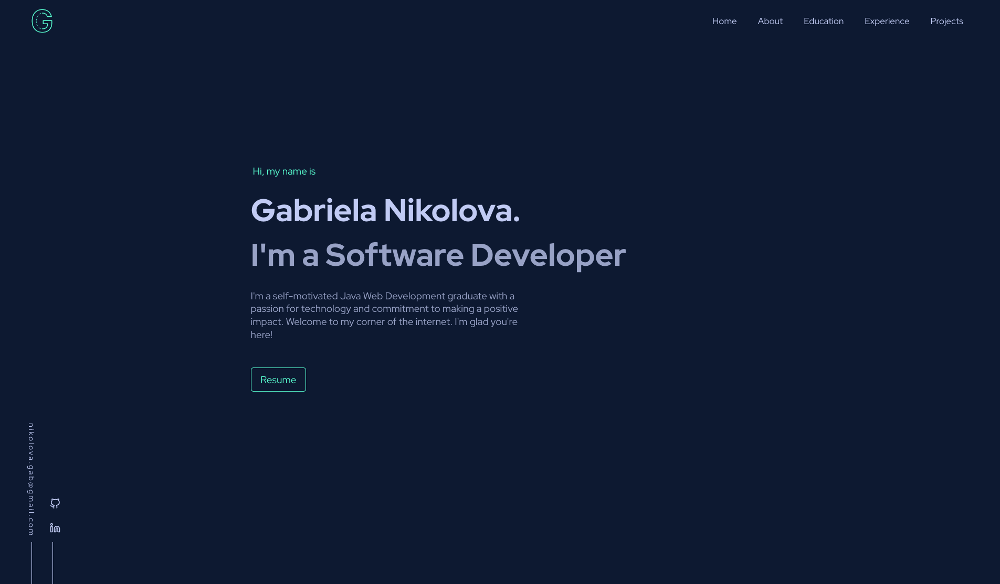
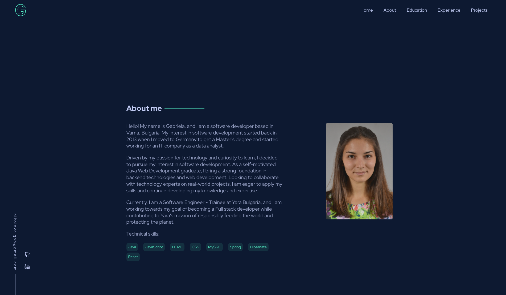
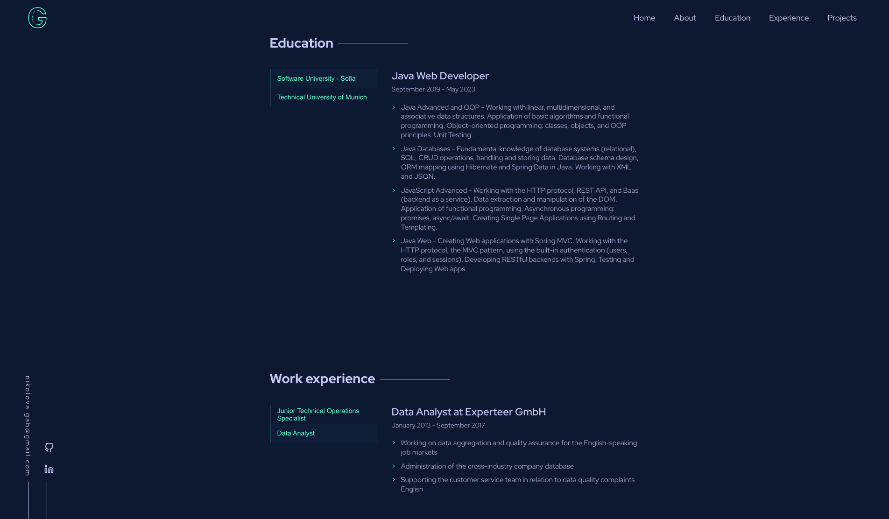
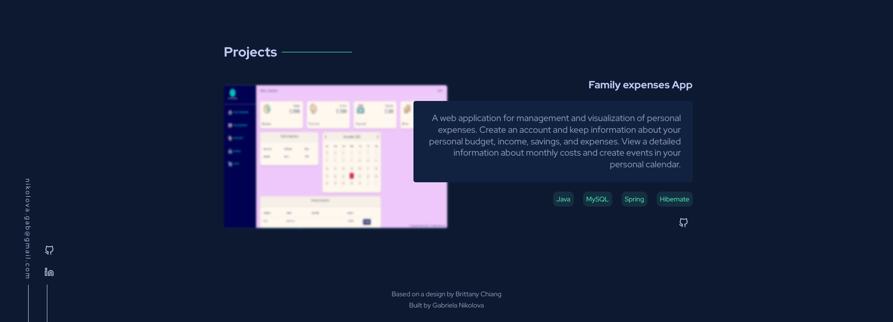

<h1 align="center" id="title">Portfolio page</h1>

Portfolio webpage built with HTML, CSS and JS.

This was a webpage built to practice my technical skills web design skills.

<h2>Demo</h2>

[https://gabrielanikolova.github.io/Portfolio/](https://gabrielanikolova.github.io/Portfolio/)

<h2>Project Screenshots:</h2>

<h2>Features</h2>

Here're some of the project's best features:

- Intuitive navigation
- Hamburger menu
- Accessibility
- Mobile-friendly interface
- Responsive Design

<h2>Built with</h2>

Technologies used in the project:

- HTML5
- CSS3
- JavaScript
- Git
- GitHub

<h2>Credits</h2>

This webpage was based on the design of Brittany Chiang. https://v4.brittanychiang.com/
